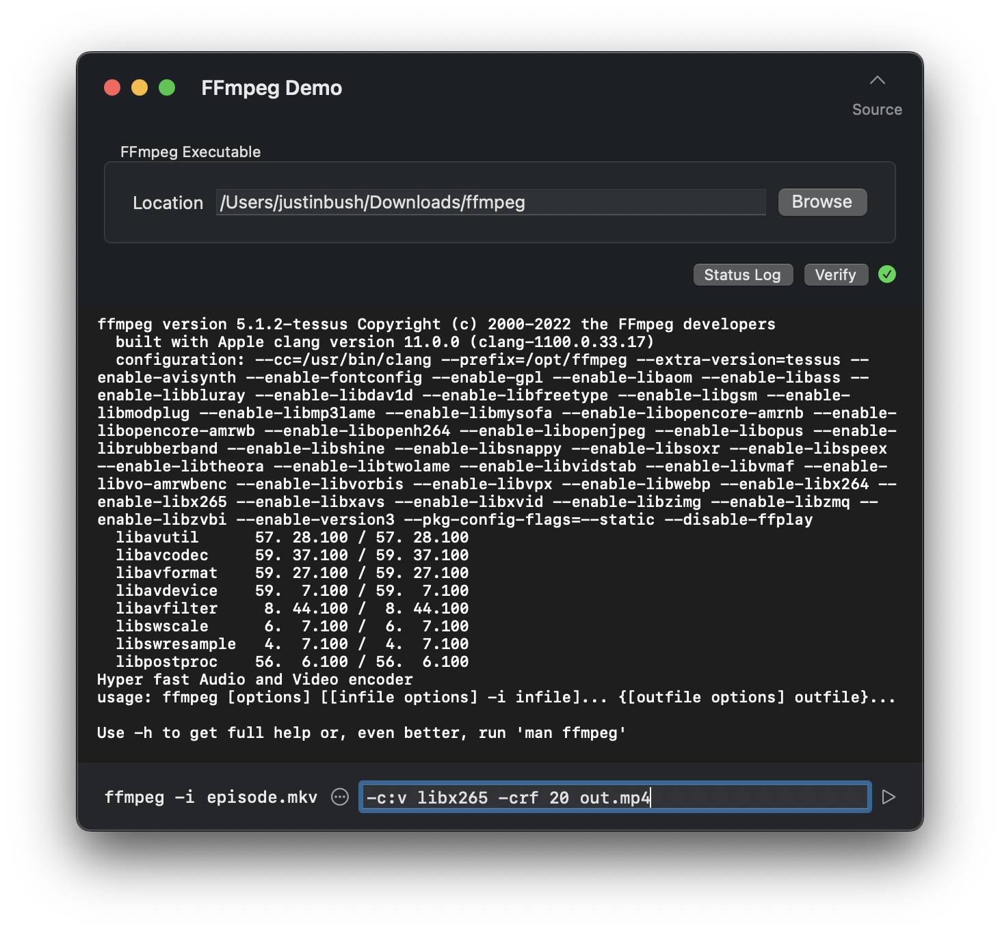

# FFmpegDemo

The ultimate goal of this project is to provide a means of interfacing with the full FFmpeg package, while still being able to maintain MIT licensing, as well as publishing rights to the App Store.

See: [The problems with GPL](https://unixsheikh.com/articles/the-problems-with-the-gpl.html)

---

Working around non-friendly license inclusion:

1. CLI layering
    1. Interfacing with existing command line tools
    2. iTerm with extra steps
2. Universal executable
    1. Interfacing with a provided executable
  
Interfacing features for an enhanced user experience:

- Convenient functionality, made tedious in shell
    - Scripting for repetitive tasks
    - Error handling
- Simplified input process
    - Manage multi-source inputs
    - Automated command outputs
    - Multi-command management
- Process monitoring with UI elements
    - Estimated duration of task
    - Percentage-based progress bar
